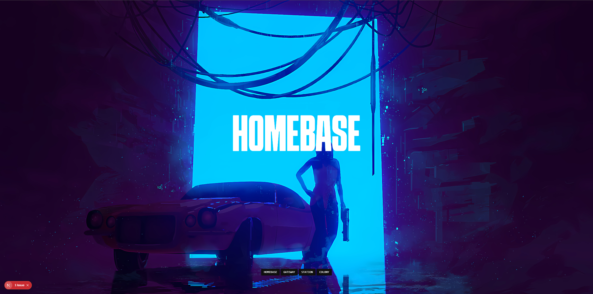

# Block-Reveal-Animation

> An interactive photo gallery showcasing GSAP's Hyperactive Block Reveal Effect with smooth page transitions



## Overview

Block-Reveal is a modern, visually stunning photo gallery built with Next.js 16 and GSAP. It demonstrates advanced animation techniques using the hyperactive block reveal effect, creating an engaging user experience with dynamic transitions between gallery pages.

## Features

- **Hyperactive Block Reveal Effect** - Eye-catching animated blocks that reveal content using GSAP's powerful animation engine
- **Smooth Page Transitions** - Seamless navigation between gallery pages with custom transition effects
- **Modern Tech Stack** - Built with Next.js 16 App Router, React 19, and TypeScript
- **Responsive Design** - Fully optimized for all screen sizes and devices
- **Tailwind CSS 4** - Styled with the latest Tailwind CSS for modern, maintainable styling
- **Custom Routing** - Enhanced navigation experience with next-transition-router

## Tech Stack

- **Framework**: [Next.js 16](https://nextjs.org/) with App Router
- **Animation**: [GSAP 3.13](https://greensock.com/gsap/)
- **Styling**: [Tailwind CSS 4](https://tailwindcss.com/)
- **Language**: [TypeScript 5](https://www.typescriptlang.org/)
- **Transitions**: [next-transition-router](https://www.npmjs.com/package/next-transition-router)

## Getting Started

### Prerequisites

- Node.js 20.x or higher
- npm, yarn, or pnpm

### Installation

1. Clone the repository:

```bash
git clone https://github.com/yourusername/block-reveal.git
cd block-reveal-animation
```

2. Install dependencies:

```bash
npm install
# or
yarn install
# or
pnpm install
```

3. Run the development server:

```bash
npm run dev
# or
yarn dev
# or
pnpm dev
```

4. Open [http://localhost:3000](http://localhost:3000) in your browser to see the gallery in action.

### Build for Production

```bash
npm run build
npm start
```

## Project Structure

```
block-reveal/
├── app/
│   ├── components/
│   │   └── Nav.jsx          # Navigation component
│   ├── providers/
│   │   └── TransitionProviders.jsx  # Page transition provider
│   ├── gateway/             # Gallery page - Gateway
│   ├── station/             # Gallery page - Station
│   ├── colony/              # Gallery page - Colony
│   ├── layout.tsx           # Root layout
│   └── page.tsx             # Home page
├── public/                  # Static assets and images
└── ...config files
```

## How It Works

The Block Reveal effect is achieved through:

1. **GSAP Animations** - Utilizing GSAP's timeline and tween capabilities for complex, coordinated animations
2. **Block Elements** - Dynamically positioned colored blocks that animate in sequence
3. **Reveal Pattern** - Blocks slide in and out to create a "wipe" reveal effect
4. **Custom Transitions** - TransitionProviders manage smooth page changes without full page reloads

## Customization

### Modifying Animation Timing

Edit the GSAP timeline parameters in your component files to adjust animation speed and easing.

### Adding New Gallery Pages

1. Create a new folder in `app/` (e.g., `app/newpage/`)
2. Add a `page.jsx` or `page.tsx` file with your content
3. Update navigation in `app/components/Nav.jsx`

### Changing Colors

Tailwind CSS classes can be modified throughout the components to match your design preferences.

## Resources

- [Next.js Documentation](https://nextjs.org/docs) - Learn about Next.js features and API
- [GSAP Documentation](https://greensock.com/docs/) - Explore GSAP animation possibilities
- [Tailwind CSS Docs](https://tailwindcss.com/docs) - Customize your styling
- [GSAP Block Reveal Tutorial](https://greensock.com/block-reveal/) - Original inspiration

## Deployment

### on Vercel

[](https://block-reveal-animation.vercel.app)

## License

MIT License - feel free to use this project for learning and inspiration.

## Acknowledgments

- GSAP team for the incredible animation library
- Next.js team for the amazing framework
- Inspired by creative web animation tutorials and demos
